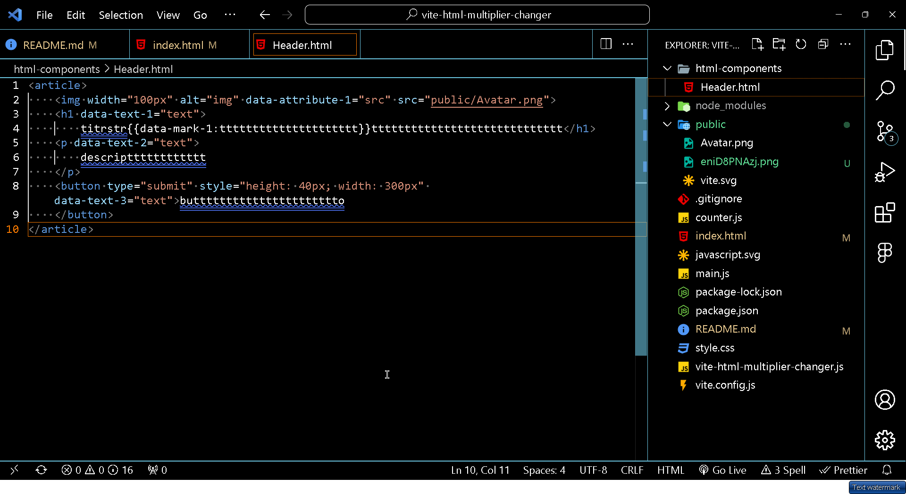

"# vite-html-multiplier-changer" 
dear applicant, here you just create a file with a capital letter. 
As in react with the name Header.html, the name of the components reused for it should be similar to the name of the file 

&lt;Header srcpars="html-components/Header.html" /&gt;

, also with a capital letter. It should be in the form of a self-closing tag.

in the src pars attribute you need to write the path where the very HTML file that you want to reuse will be located, that same HTML component in other words It’s very simple my friend, I’ll take screenshots for you too to simplify your layout.

if in a reused component you want to change all the text content in a certain tag, you need to write the date text
 data-text-1="text".

in the tag itself, my dear You are an applicant, you need to indicate the same attribute with the same number with the description that you want to replace for exemple:

&lt;Header srcpars="html-components/Header.html" data-text-1="description Bro" /&gt;.

if you, my dear applicant, want to change the text specifically in a certain tag, you need to take its curly braces twice and specify certain attributes inside, for example:

{{data-mark-1:ttttttttttttttttttttt}}.

in the reused component itself, my dear applicant, you need to indicate the following brand, for example:

&lt;Header srcpars="html-components/Header.html" data-mark-1="Heloyin" /&gt;.

in this attribute data-mark-1 with a number you need to indicate the value of this attribute word or combination What do you want to change to and you won’t believe it will work.

that's not all, my dear applicant, a bonus awaits you, you still have the opportunity to change the attributes of the reused component in a certain tag that you want, you just need to specify the date attribute with a certain number and the value of this attribute should be the name of the attribute that you want to replace, for example

 &lt;img width="100px" alt="img" data-attribute-1="src" src="public/Avatar.png"&gt;.

very important point Be careful the attribute that you want to change in a certain tag must be at the end of the tag the data-attribute-1="src" must be before it only then it will work. for exemple:

&lt;img width="100px" alt="img" data-attribute-1="src" src="public/Avatar.png"&gt;.

in the reused component itself, you indicate the same date attribute with the value of what you want to change to, for example:

&lt;Header srcpars="html-components/Header.html" data-attribute-1="public/vite.svg" /&gt;.

my dear applicant, there is one more option. Very useful, let’s say you want to change all the text in a certain tag in a reused component, you can do this by specifying the date text with a certain number with the value text very important at the end of this tag, for example: 

&lt;h1 data-text-1="text"&gt; ttttttttttttttttttttttttttttt&lt;/h1&gt;.
in the reused component itself, you will need to specify the same date text with the same number with the value that you want to change the same text to, for example:

&lt;Header srcpars="html-components/Header.html" data-text-1="Hello" /&gt;.

To summarize, we can change the text completely in the tag in the reused component, we can change the attributes that we want, and we can change the words or phrases that we want in the reused component.

I’ll make more screenshots for you to make it even more clear. Why did I tell you all this? Good luck to you, my dear applicant.

